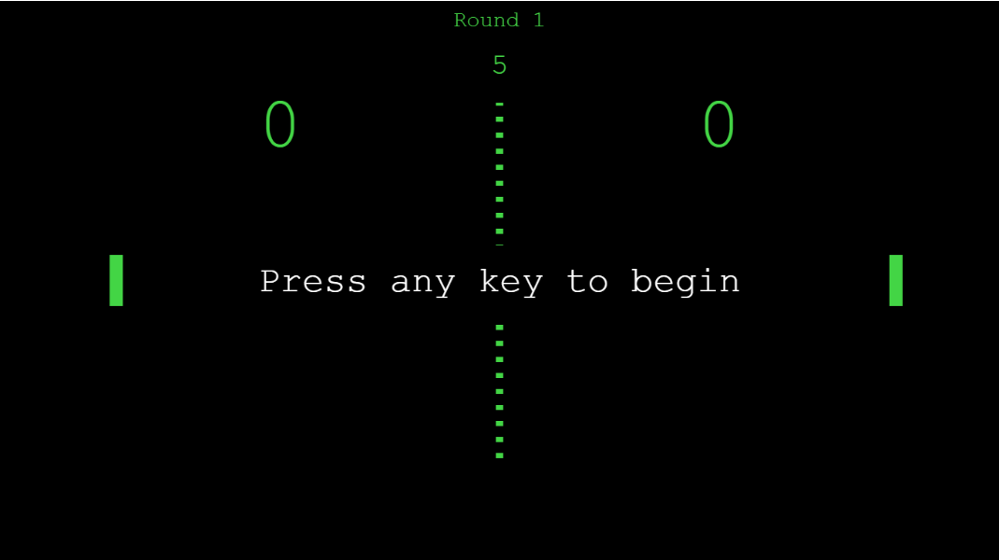

# Pong

Pong é um jogo eletrônico de esporte de arcade com temática de tênis de mesa, com gráficos bidimensionais, desenvolvido pela Atari e lançado originalmente em 1972.

Esta é uma réplica deste antigo jogo, foi desenvolvido durante uma live coding no curso <i>Tech Academy</i> da <b>StartSe</b>.

## Screenshot

